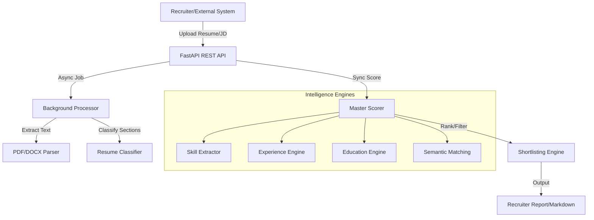

# ATS System Architecture

This document provides a comprehensive overview of the ATS (Applicant Tracking System) architecture, component interactions, and data flow.

## 1. System Overview

The ATS is a modular, AI-powered system designed to automate the recruitment pipeline from resume ingestion to candidate shortlisting. It leverages NLP, semantic matching, and a transparent scoring engine to provide explainable recruitment decisions.

## 2. High-Level Architecture

The system is composed of several layers:

1.  **API Layer (FastAPI)**: Provides RESTful endpoints for resume upload, parsing, scoring, and shortlisting.
2.  **Parsing Layer**: Handles raw file extraction (PDF/DOCX) and intelligent section classification.
3.  **Intelligence Engines**: Specialized modules for scoring skills, experience, education, and semantic relevance.
4.  **Orchestration Layer (Master Scorer)**: Aggregates scores from individual engines into a final candidate profile.
5.  **Data Layer**: Uses structured Pydantic models and JSON schemas for consistency.

## 3. Data Flow

### 3.1 Resume Ingestion Pipeline
1.  **Ingestion**: `PDFParser` or `DocxParser` extracts raw text.
2.  **Cleaning**: `TextCleaner` (in `utils`) normalizes whitespace and characters.
3.  **Classification**: `ResumeClassifier` segments text into Skills, Experience, Education, etc.
4.  **Extraction**: Specialized parsers (`ExperienceParser`, `EducationParser`) convert text segments into structured JSON objects.

### 3.2 Scoring & Matching Pipeline
1.  **JD Parsing**: `JDParser` extracts requirements (Required Skills, Min Experience, Education) from the Job Description.
2.  **Component Scoring**:
    -   **Skill Match**: Calculates overlap between extracted resume skills and JD required skills.
    -   **Experience Relevance**: Evaluates tenure and role-specific relevance.
    -   **Education Alignment**: Validates degree levels and field of study.
    -   **Semantic Similarity**: Uses BERT-based or TF-IDF/Cosine similarity for contextual overlap.
3.  **Aggregation**: `MasterScorer` applies weights to these scores to generate a `final_score`.

## 4. Key Components

| Component | Path | Responsibility |
| :--- | :--- | :--- |
| **API** | `api/main.py` | Routing, request validation, and async job management. |
| **Parsers** | `parsers/` | File extraction and section classification logic. |
| **ATS Engine** | `ats_engine/` | Core scoring engines (Skill, Exp, Edu, Semantic). |
| **Data Models** | `models/` | Pydantic and Dataclass definitions for resumes and JDs. |
| **Utils** | `utils/` | Shared utilities like text cleaning and fairness/bias checks. |

## 5. Technology Stack
- **Language**: Python 3.9+
- **Web Framework**: FastAPI
- **Data Handling**: Pydantic v2, Pandas
- **NLP**: SpaCy / NLTK (for extraction), Scikit-learn (for semantic similarity)
- **Reporting**: Pandas (CSV/Excel), Markdown
