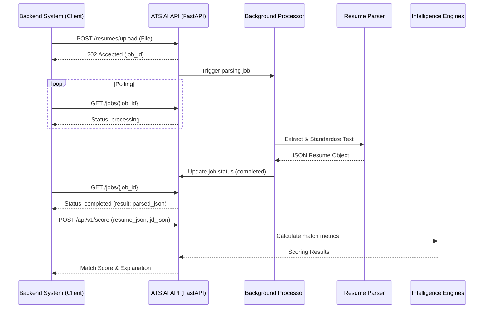

# ATS AI Integration Flow Document

This document describes the end-to-end workflow for backend systems integrating with the ATS AI module.

## 1. High-Level Architecture

## 2. Phase 1: Resume Ingestion (Asynchronous)

Because resume parsing involves heavy NLP tasks (skill extraction, section classification, semantic analysis), it is handled asynchronously.

1.  **Submission**: The backend system uploads the raw file.
2.  **Tracking**: The API returns a `job_id`.
3.  **Completion**: Once status is `completed`, the backend retrieves the structured JSON.

## 3. Phase 2: Candidate Scoring (Synchronous)

Once the resume is parsed, scoring is typically a fast computation using pre-loaded models or rule-based logic.

-   **Input**: Structured Resume JSON + Job Description JSON.
-   **Output**: 
    -   `match_score`: 0-100 float.
    -   `breakdown`: Percentages for skills, experience, and education.
    -   `recommendation`: AI-generated justification for the score.

## 4. Phase 3: Shortlisting (Bulk Evaluation)

The `/shortlist` endpoint allows ranking a list of candidates against a single JD.

-   **Workflow**:
    1.  Backend passes a JD and an array of Parse-ready Resume JSONs.
    2.  API iterates through candidates, applying weights.
    3.  Returns a ranked list with specific "highlights" (e.g., "Top 1% match for Python Expert").

## 5. Security & Error Handling

-   **API Keys**: All requests should include an `X-API-KEY` in the header (implementation pending).
-   **Rate Limiting**: Integrated via middleware to prevent abuse during bulk uploads.
-   **Data Retention**: The API does not store files permanently; they are deleted after parsing. Structured data should be persisted in the caller's database.

## 6. Logging Standards

Logs are formatted to be ingestion-friendly for ELK/Datadog:
- `timestamp`: ISO-8601
- `context`: [API | WORKER | SCORER]
- `job_id`: Correlation ID for end-to-end tracking
- `level`: INFO, WARNING, ERROR
- `message`: Descriptive status
- `extra`: JSON metadata (e.g., file_size, process_time)
